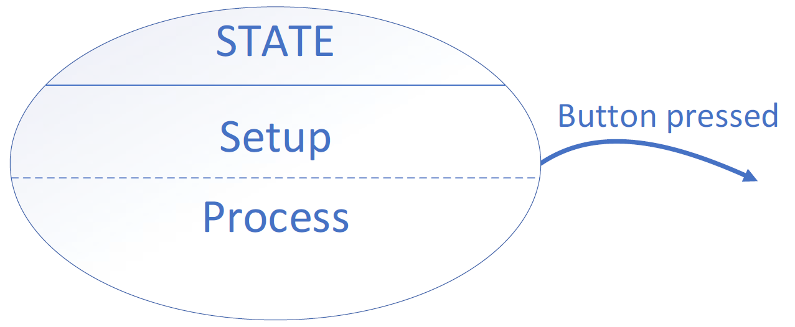
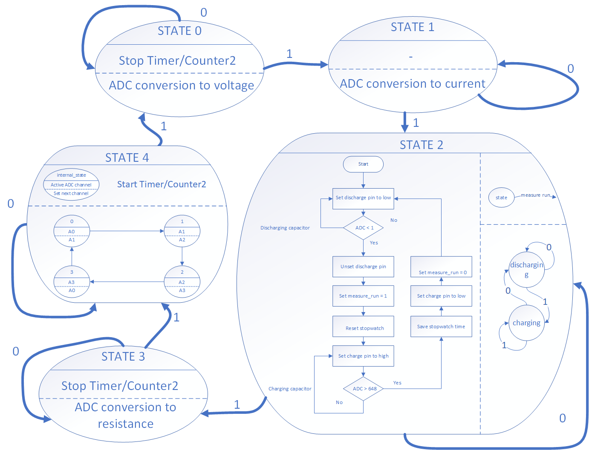

#  Measuring electrocity project
This project is final work of AVR course at Brno University of Technology

### Topic
This project is a versatile and user-friendly system for measuring various electrical parameters, including voltage, capacitance, resistance, current. The primary focus is on applications such as solar panel and battery meters.

### Team members

* David Ecler (responsible for documentation)
* Slávek Rylich (responsible for programming)
* Jakub Chrástek (responsible for HW developer)

## Theoretical description and explanation

System for measuring various electrical parameters such as voltage, capacitance, resistance and current.
The units used are Arduino UNO, OLED display and measured components.

Arduino reads values on analog inputs. Using an ADC converter, it converts the measured value into a digital value using the following formula and prints it on the display:

There is only one ADC converter in Arduino. But it contains more channels between which this one converter can switch and converge the analog value from that channel.
In our case, it converts 4 quantities voltage, capacitance, resistance and current, each connected to a separate analog input, see /schema/.
In order to be able to measure all our parameters, it is necessary to switch channels so that the ADC value of the corresponding parameter is measured at every moment. This is achieved using a button. When pressed, the current channel changes to the next one and the next parameter is measured.
The ADC conversion itself is required to convert the value periodically so that we are able to record the measured quantity over time. This is made possible by Timer0, which triggers the ADC conversion every 3ms.
Completion of the conversion is captured by the interrupt vector for the ADC, from where the ADC values are recalculated to a specific range of given parameter.

The button press is captured by a rising edge on the INT0 pin, which causes the button press to be interrupted. Debouncer is solved by a time slot, within which it is possible to press the button only once.

### User control
The user selects the measured quantity by pressing a button. It is also possible to start an automated measurement, when all quantities are measured simultaneously.

