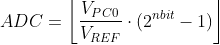
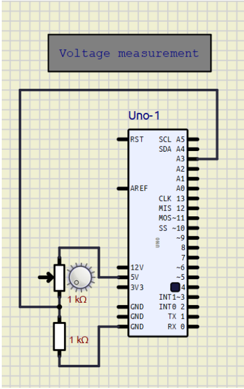
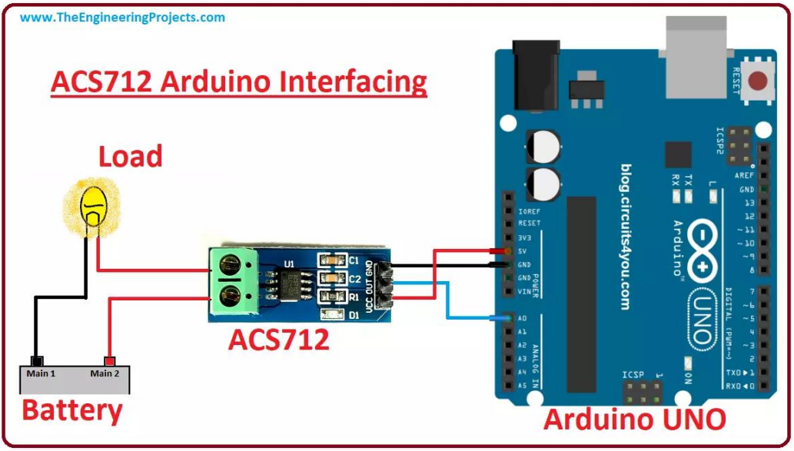
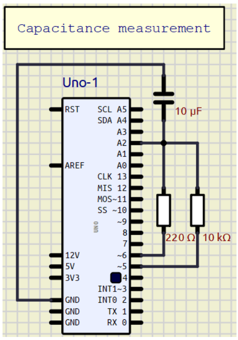

#  Measuring electrocity project
This project is final work of AVR course at Brno University of Technology

### Topic
This project is a versatile and user-friendly system for measuring various electrical parameters, including voltage, capacitance, resistance, current. The primary focus is on applications such as solar panel and battery meters.

### Team members

* David Ecler (responsible for documentation)
* Slávek Rylich (responsible for programming)
* Jakub Chrástek (responsible for HW developer)

## Theoretical description and explanation

System for measuring various electrical parameters such as voltage, capacitance, resistance and current.
Used units are Arduino UNO, OLED display and measured components.

Arduino reads values on analog inputs. Using an ADC converter, it converts the measured value into a digital value using the following formula and prints it on the display:

There is only one ADC converter in Arduino. But it contains more channels between which this one converter can switch and converge the analog value from that channel.
In our case, it converts 4 quantities voltage, capacitance, resistance and current, each connected to a separate analog input, see /schema/.
In order to be able to measure all our parameters, it is necessary to switch channels so that the ADC value of the corresponding parameter is measured at every moment. This is achieved using a button. When pressed, the current channel changes to the next one and the next parameter is measured.
The ADC conversion itself is required to convert the value periodically so that we are able to record the measured quantity over time. This is made possible by Timer0, which triggers the ADC conversion every 3ms.
Completion of the conversion is captured by the interrupt vector for the ADC, from where the ADC values are recalculated to a specific range of given parameter.

The button press is captured by a rising edge on the INT0 pin, which causes the button press to be interrupted. Debouncer is solved by a time slot, within which it is possible to press the button only once.

### User control
The user selects the measured quantity by pressing a button. It is also possible to start an automated measurement, when all quantities are measured simultaneously.

## Hardware description

### Voltage:
The voltage measurement is performed 
according to the following circuit:

Where 5V is the supply voltage from the Arudino uno. Furthermore, the circuit contains one 1kΩ 
resistor connected to ground and one variable value Ω resistor. The voltage is measured at pin A0, 
which is connected between the resistors in series.

### Current:
The current is measured using a current sensor. The sensor works by measuring the voltage, which it 
converts to an ADC. However, the current sensor has a 2.5V offset, which means that at 2.5V the 
current is 0A. and then it calculates either positive or negative depending on the voltage.

### Capacitance:
This method of measurement calculates how long it takes for the capacitor to reach 63.2% of its maximum voltage. Capacitance can be easily calculated by following formula :
C = TC / R
      
 *    TC = time constant period in seconds

 *    R = resistance in ohms

 *    C = capacitance in farads (1 microfarad (ufd) = .000001 farad = 10^-6 farads )

In the end, this measurement was heavily inaccurate due to part value tolarences and construction of board it self. So we measured 3 differently sized capacitors and according to the system of equations on line 319 of our code, we managed to achieve somewhat accurate results. On the oled display the value in uF is displayed with +-20uF accuracy.

